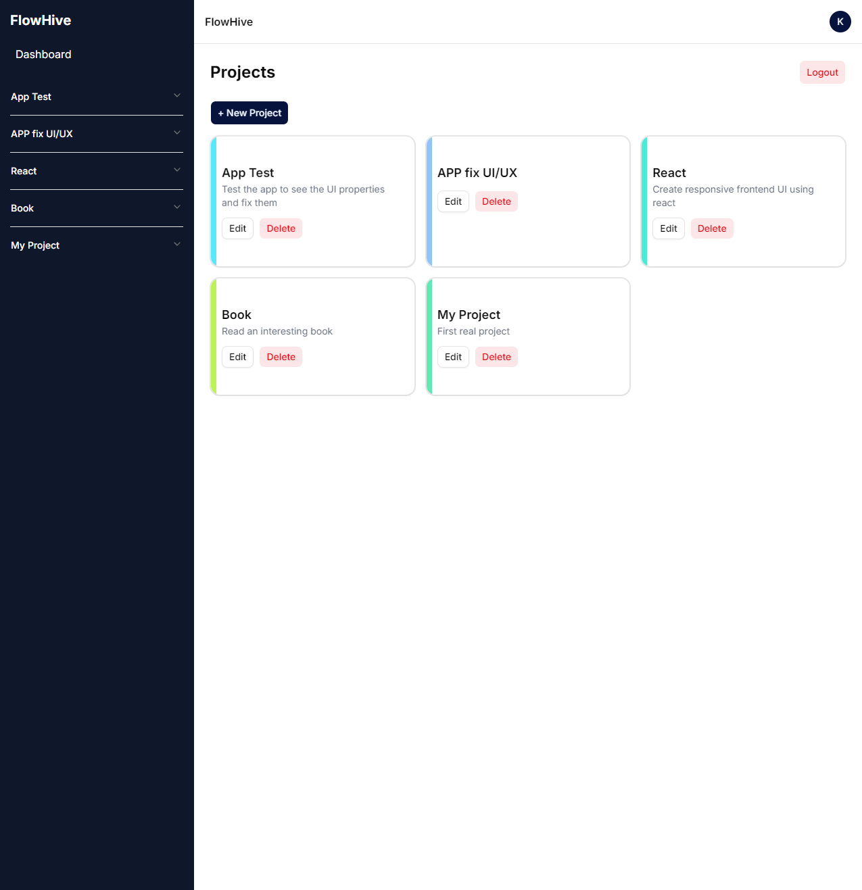
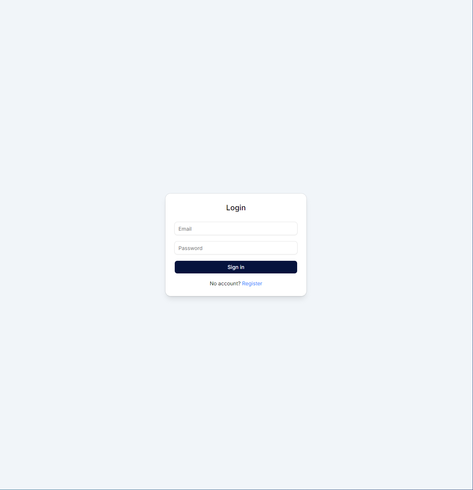
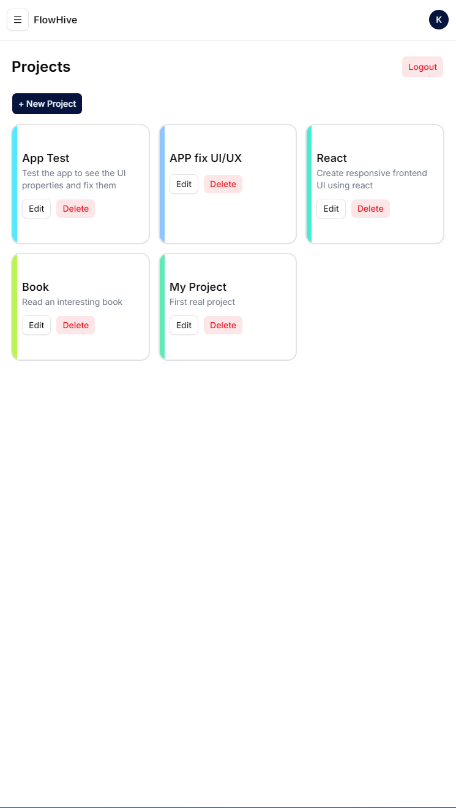
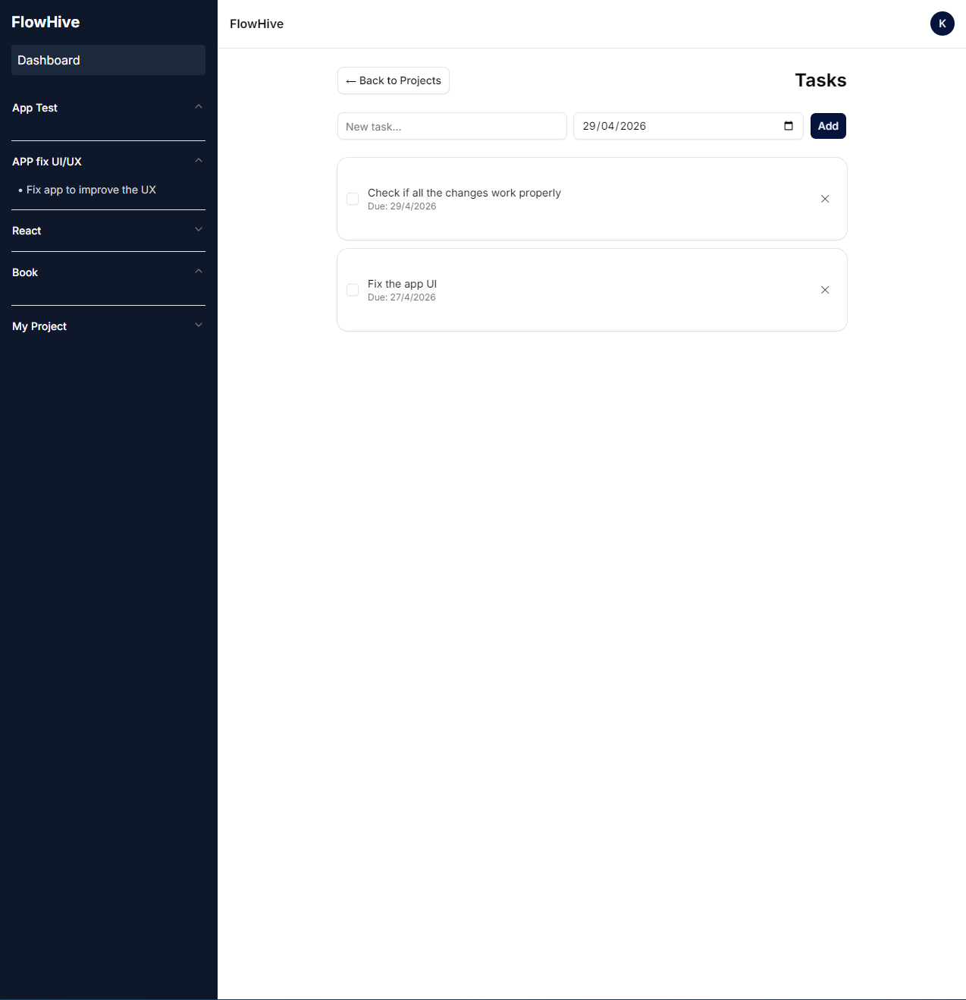

# FlowHive – Full Stack PERN Project Management App

A modern full-stack project management platform built with the **PERN stack** (PostgreSQL, Express, React, Node.js) featuring authentication, responsive SaaS-style UI, project/task organization, role-ready architecture, and cloud deployment support.

---

Live Demo
Frontend: https://client-fzx3.onrender.com
Backend API: https://server-mvgt.onrender.com

---

# Features

## Authentication

- JWT Authentication
- Secure password hashing with bcrypt
- Protected routes
- Persistent login sessions

## Project Management

- Create projects
- Edit projects
- Delete projects
- Dynamic project accent colors
- Responsive project cards

## Task Management

- Create tasks inside projects
- Mark tasks as completed
- Task completion states
- Due dates support
- Delete tasks
- Responsive task layout

## Modern SaaS UI

- Built with Tailwind CSS v4
- shadcn/ui component system
- Responsive sidebar navigation
- Mobile-friendly collapsible sidebar
- Modern card layouts
- Avatar/profile UI
- Pastel accent system
- Smooth transitions and hover animations

## Deployment Ready

- Frontend deployable on Render
- Backend deployable on Render
- PostgreSQL hosted on Neon
- Environment variable support
- Production-ready structure

---

# Tech Stack

## Frontend

- React
- Vite
- React Router DOM
- Axios
- Tailwind CSS v4
- shadcn/ui
- Lucide React Icons

## Backend

- Node.js
- Express.js
- PostgreSQL
- JWT
- bcrypt
- dotenv
- CORS

## Database

- PostgreSQL
- Neon Database

---

# Deployment

## Frontend

Deploy frontend on:

- Render Static Site

## Backend

Deploy backend on:

- Render Web Service

## Database

Use:

- Neon PostgreSQL

---

# Responsive Design

The application is fully responsive and optimized for:

- Desktop
- Tablet
- Mobile Devices

Features include:

- Collapsible sidebar
- Responsive grid layout
- Mobile navigation drawer
- Adaptive spacing

---

# Learning Goals

This project was built to practice:

- Full-stack development
- REST API design
- PostgreSQL relationships
- JWT authentication
- React state management
- Responsive UI design
- Modern SaaS architecture
- Cloud deployment

---

# Screenshots

- Dashboard

- Login Page

- Mobile collapsable Sidebar

- Tasks View

